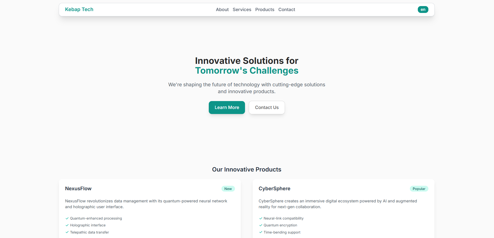

# Kebap Tech - Next.js Tailwind CSS Website

This is a [Next.js](https://nextjs.org) project using Tailwind CSS, Biome, and Bun.

## Preview



## Live Demo

The project is deployed on Vercel and can be viewed at: [https://kebap-nextjs-tailwind.vercel.app/](https://kebap-nextjs-tailwind.vercel.app/)

## Getting Started

First, install the dependencies:

```bash
bun install
```

Then, run the development server:

```bash
bun start
```

Open [http://localhost:3000](http://localhost:3000) with your browser to see the result.

You can start editing the page by modifying `app/page.tsx`. The page auto-updates as you edit the file.

This project uses [`next/font`](https://nextjs.org/docs/app/building-your-application/optimizing/fonts) to automatically optimize and load [Geist](https://vercel.com/font), a new font family for Vercel.

## Deployed on Vercel

This project is deployed using the [Vercel Platform](https://vercel.com/new?utm_medium=default-template&filter=next.js&utm_source=create-next-app&utm_campaign=create-next-app-readme) from the creators of Next.js.

## Developer 👨‍💻

Created by [Burak Ünal](https://burakunal28.vercel.app/)

## License

This project is open source and available under the [MIT License](LICENSE).
